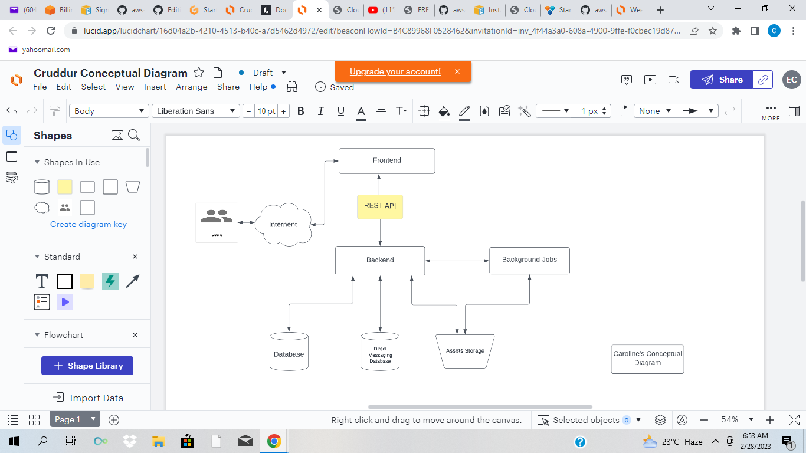

# Week 0 — Billing and Architecture

## Required Homework

### Install And Verify AWS CLI 
 
I used my local environment on windows because I was unable to use Gitpod or Github codespaces due to browser issues.

I followed the following instructions for the configuration of my local machine on windows.

I did the following steps to install my AWS CLI.

I installed the AWS CLI for windows 10 via command in **Command Prompt**:

I followed the instructions on the [AWS CLI Install Documentation Page](https://docs.aws.amazon.com/cli/latest/userguide/getting-started-install.html)


```
msiexec.exe /i https://awscli.amazonaws.com/AWSCLIV2.msi
```

I attempted to run the command by typing in 'aws' but got an error which by my closing and reopening the command prompt later worked.


### Create a Budget

I created a zero spend budget and a credit spend budget.
I created both for $1 because I cannot afford any kind of spend.


### Recreate Logical Architectural Diagram


[Lucid Charts Share Link](https://lucid.app/lucidchart/e739c2a0-2339-42d1-8081-580b7d0bb86a/edit?viewport_loc=-108%2C63%2C2341%2C1027%2C0_0&invitationId=inv_0eed8aec-8a9f-4c44-ac80-d58727ae0a1a)

### Recreate Conceptual Architectural Diagram




